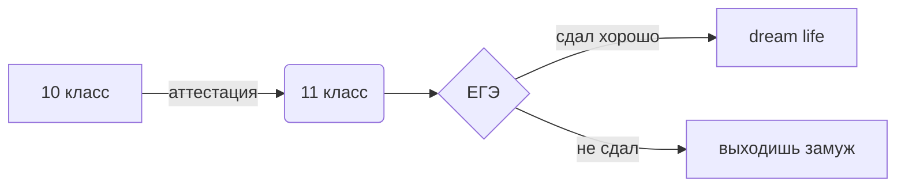

# Шабанова_Галина_122

# Аккаунты:

[аккаунт codepen](https://codepen.io/Galua122)

[аккаунт wordpress](https://wordpress.com/home/reallife979489743.wordpress.com)
 
 
# Список файлов в репозитории:

[Морзянка.py](https://github.com/Galua122/works/blob/main/%D0%BC%D0%BE%D1%80%D0%B7%D1%8F%D0%BD%D0%BA%D0%B0.py)-перевод кода Морзе

[10 в не10.py](https://github.com/Galua122/works/blob/main/10%20%D0%BD%D0%B510.py)-Перевод из десятичной СС в указанную 

СС 8ичная таблица умножения.py-переводит числа из 10чной в 8чную

[ЕГЭ.txt](https://github.com/Galua122/works/blob/main/%D0%95%D0%93%D0%AD.txt)-1 задание ЕГЭ

[Нейронка.png](https://github.com/Galua122/works/blob/main/%D0%9D%D0%B5%D0%B9%D1%80%D0%BE%D0%BD%D0%BA%D0%B0.png)-скриншот из нейросимулятора

булева алгебра(книга 2, 3).xlsx-логические высказывания

[система умножения.py](https://github.com/Galua122/works/blob/main/%D1%81%D0%B8%D1%81%D1%82%D0%B5%D0%BC%D0%B0%20%D1%83%D0%BC%D0%BD%D0%BE%D0%B6%D0%B5%D0%BD%D0%B8%D1%8F.py)-система умножения в python

[таблица умножения(с40, с50).xlsx](https://github.com/Galua122/works/blob/main/%D1%8140%2C%D1%8150.xlsx)-таблица уможения в excel

[программа перевода по ходу Хэмминга.ipynd](https://github.com/Galua122/works/blob/main/%D0%BF%D1%80%D0%BE%D0%B3%D1%80%D0%B0%D0%BC%D0%BC%D0%B0%20%D0%BF%D0%B5%D1%80%D0%B5%D0%B2%D0%BE%D0%B4%D0%B0%20%D0%BF%D0%BE%20%D1%85%D0%BE%D0%B4%D1%83%20%D0%A5%D1%8D%D0%BC%D0%BC%D0%B8%D0%BD%D0%B3%D0%B0.ipynb)-программа перевода по коду Хэмминга в Юпитере

[BDtest.py](https://github.com/Galua122/works/blob/main/bdtest.py)-база данных в python

[turtle(дерево)](https://github.com/Galua122/works/tree/main/turtle).py-рисунок дерева в python

[морзе.xlsx](https://github.com/Galua122/works/blob/main/%D0%BC%D0%BE%D1%80%D0%B7%D0%B0.xlsx)-перевод кода Морзе

bool.py-булевое выражение в python

# Пример Latex формула

$$ F=mc^2 $$

# Приведение к нормальной форме

$$ \color{Orange}A \oplus B = (\bar{A} \wedge  B) \vee (A \wedge  \bar{B)} $$

$$ \color{Fuchsia}\bar{E_{1}^{2}}=\sqrt[]{\frac{Fa^{x-1} }{(x-1)\cdot x}}+\alpha^{\frac{1}{3}}_{1}+\beta^{\frac{2}{3}}_{2} $$

$$ \color{Blue}\overrightarrow{S}=\overrightarrow{V_{0}}\cdot t+\frac{\overrightarrow{a}t}{2} $$

$$ \color{Green}x = x_{0}+v_{0}\cdot t+\frac{at^{2}}{2} $$

| Номер задания | Готовность |
| ------ | ------ |
| 1 |  |
| 2 |  |
| 3 |  |
| 4 |  |
| 5 |  |
| 6 |  |
| 7 |  |
| 8 |  |
| 9 |  |
| 10 |  |
| 11 |  |
| 12 |  |
| 13 |  |
| 14 |  |
| 15 |  |
| 16 |  |
| 5 |  |
| 6 |  |
| 7 |  |
| 8 |  |
| 9 |  |
| 10 |  |
| 11 |  |
| 12 |  |
